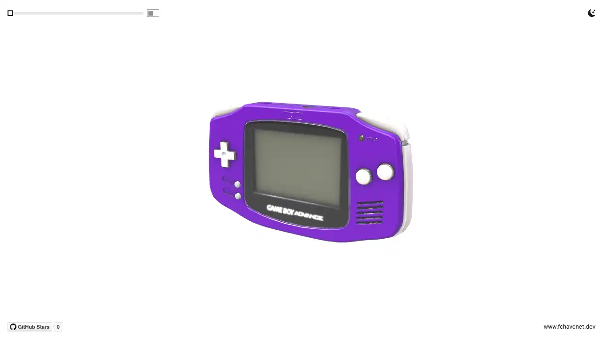
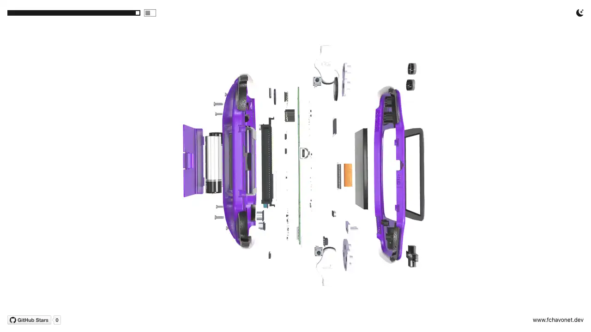
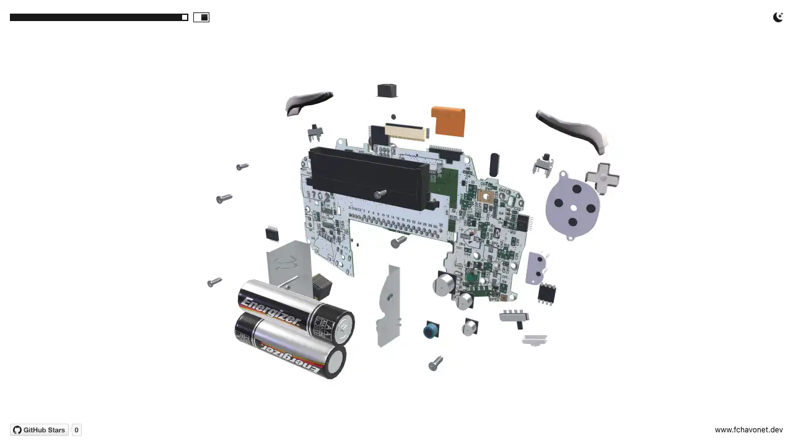

# GBA Exploded View

## Description

GBA Exploded View is an interactive 3D experiment that lets you explore the internal construction of a Game Boy Advance directly in the browser.

The console can be rotated, inspected, and progressively disassembled using an exploded-view slider.

The project combines imported 3D models with components generated directly in JavaScript. Motherboard photographs, technical diagrams, and Nintendo® documentation were used as references to reproduce the shape, placement, and arrangement of the real components as faithfully as possible.

Some details and proportions have been simplified or adjusted for the interactive presentation, but the overall reconstruction aims to remain close to the construction of an actual Game Boy Advance.

This project was created as a study of 3D reconstruction, procedural geometry, materials, lighting, and interactive animation using Three.js.

The experience is designed for desktop use.

## Objectives

- Recreate the external appearance and internal structure of a Game Boy Advance.
- Combine imported GLB models with procedural Three.js geometry.
- Position components using motherboard photographs and the existing console geometry.
- Implement a smooth transition between assembled and exploded views.
- Explore transparent, metallic, plastic, and silicone materials.
- Provide intuitive camera controls through a minimal interface.
- Avoid unnecessary rendering when the scene is stationary.

## Tech Stack


## File Description

| **FILE**     | **DESCRIPTION**                                                      |
| :----------: | -------------------------------------------------------------------- |
| `assets`     | Contains the resources required for the repository.                  |
| `index.html` | Main HTML structure.                                                 |
| `style.css`  | Global styles and visual adjustments.                                |
| `script.js`  | Screen-size detection and desktop-use warning.                       |
| `gba.js`     | Three.js scene, procedural components, materials, camera controls... |
| `LICENSE`    | Proprietary license and usage restrictions for the project.          |
| `README.md`  | The README file you are currently reading 😉.                        |

## Installation & Usage

### Installation

1. Clone this repository:
    - Open your preferred Terminal.
    - Navigate to the directory where you want to clone the repository.
    - Run the following command:

```
git clone https://github.com/fchavonet/creative_coding-gba_exploded_view.git
```

2. Open the cloned repository.

3. Start a local web server from the project directory:

```
python3 -m http.server 8000
```

4. Open [http://localhost:8000](http://localhost:8000) in your web browser.

> The project must be served through HTTP to load its JavaScript modules, 3D models, and textures correctly. Opening `index.html` directly from the file system is not supported.

### Usage

1. Wait for the loading spinner to disappear.

2. Click and drag to rotate the console.

3. Use the mouse wheel to zoom in or out.

4. Move the slider to progressively explode or reassemble the console.

5. Enable `Hide shell` to inspect the internal components without the shell and screen assembly.

You can also test the project online by clicking [here](https://fchavonet.github.io/creative_coding-gba_exploded_view/).

<p align="center">
    <picture>
        <source media="(prefers-color-scheme: light)" srcset="./assets/screenshots/desktop_page_screenshot-light.webp">
        <source media="(prefers-color-scheme: dark)" srcset="./assets/screenshots/desktop_page_screenshot-dark.webp">
        
    </picture>
</p>

<p align="center">
    <picture>
        <source media="(prefers-color-scheme: light)" srcset="./assets/screenshots/desktop_page_exploded_screenshot-light.webp">
        <source media="(prefers-color-scheme: dark)" srcset="./assets/screenshots/desktop_page_exploded_screenshot-dark.webp">
        
    </picture>
</p>

<p align="center">
    <picture>
        <source media="(prefers-color-scheme: light)" srcset="./assets/screenshots/desktop_page_hidden_shell_screenshot-light.webp">
        <source media="(prefers-color-scheme: dark)" srcset="./assets/screenshots/desktop_page_hidden_shell_screenshot-dark.webp">
        
    </picture>
</p>

## What's Next?

- Add optional labels to identify the main components.
- Explore the addition of a game cartridge and its internal PCB.
- Continue refining small geometric details and material rendering.

## Thanks

- A big thank you to my friends Pierre and Yoann, always available to test and provide feedback on my projects.

## License

Copyright © 2026 - Fabien Chavonet. All rights reserved.

This repository is publicly accessible for viewing and educational reference only. No permission is granted to use, copy, modify, reproduce, distribute, sublicense, sell, or incorporate this project or any portion of its source code into another project without prior written authorization from the copyright holder.

See the [LICENSE](./LICENSE) file for the complete terms.

## Author(s)

**Fabien CHAVONET**
- GitHub: [@fchavonet](https://github.com/fchavonet)
